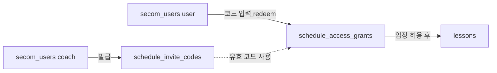
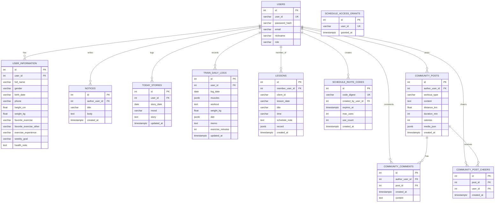

# Pace 완성 ERD (users + inbody)

> **현재 Neon에 올라가는 3NF 스키마 전체** — 정규화 단계별 설명은 [[PACE_ERD_NORMALIZATION]]  
> 요약·기능 매핑: [[PACE_ERD]]

Neon PostgreSQL · FK 허브: **`secom_users.id`**

**Obsidian:** Mermaid 플러그인 ON → 읽기 모드(`Ctrl+E`)

#pace #erd #full

---

## 스케줄 입장 흐름 (코드 발급)

> `schedule_access` = 구 공통 암호(선택·레거시). **현재 UI는 일회용 코드** 위주.

---

## 통합 ERD (관계 — Obsidian용)

> Mermaid `erDiagram`은 `float`, `record`, `time` 같은 이름·타입에서 **파싱 에러**가 납니다.  
> 아래는 **관계 + 핵심 키만** 표시합니다. 전체 컬럼은 다음 절 표를 보세요.  
> **점선 의미:** DB FK는 없고 앱에서 `user_id` 문자열·redeem 로직으로 연결.

다이어그램 `user_role` = DB 컬럼 `role` · `login_user_id` = `schedule_access_grants.user_id` · `created_by_user_id` = 코치 로그인 ID

---

## 전체 컬럼 (표)

### users

| `secom_users` | 타입         | 비고                  |
| ------------- | ---------- | ------------------- |
| id            | int PK     |                     |
| user_id       | varchar UK | 로그인 ID              |
| password_hash | varchar    |                     |
| email         | varchar    |                     |
| nickname      | varchar    |                     |
| role          | varchar    | admin / user/ coach |

| `user_information`      | 타입        | 비고               |
| ----------------------- | --------- | ---------------- |
| id                      | int PK    |                  |
| user_id                 | int FK UK | → secom_users.id |
| full_name               | varchar   |                  |
| gender                  | varchar   |                  |
| birth_date              | varchar   |                  |
| phone                   | varchar   |                  |
| height_cm               | float     |                  |
| weight_kg               | float     |                  |
| favorite_exercise       | varchar   |                  |
| favorite_exercise_other | varchar   |                  |
| exercise_experience     | varchar   |                  |
| weekly_goal             | varchar   |                  |
| health_note             | text      |                  |

| `schedule_access`  | 타입          | 비고      |
| ------------------ | ----------- | ------- |
| id                 | int PK      | 앱 전역 1행 |
| password_hash      | varchar     |         |
| updated_by_user_id | varchar     | FK 없음   |
| updated_at         | timestamptz |         |

| `schedule_access_grants` | 타입          | 비고                                    |
| ------------------------ | ----------- | ------------------------------------- |
| id                       | int PK      |                                       |
| user_id                  | varchar UK  | 로그인 문자열 · `secom_users.user_id`와 동일 값 |
| granted_at               | timestamptz | 코드 redeem 성공 시 등록                     |

| `schedule_invite_codes` | 타입          | 비고                           |
| ----------------------- | ----------- | ---------------------------- |
| id                      | int PK      |                              |
| code_digest             | varchar UK  | SHA-256(대문자 코드) · 평문은 DB에 없음 |
| created_by_user_id      | varchar     | 코치 로그인 ID                    |
| expires_at              | timestamptz | 기본 7일                        |
| max_uses                | int         | 기본 1                         |
| use_count               | int         |                              |
| created_at              | timestamptz |                              |

### inbody

| `today_stories` | 타입          | 비고                 |
| --------------- | ----------- | ------------------ |
| id              | int PK      |                    |
| user_id         | int FK      | UK with story_date |
| story_date      | date        |                    |
| mood            | varchar     |                    |
| story           | text        |                    |
| updated_at      | timestamptz |                    |

| `train_daily_logs` | 타입 | 비고 |
|--------------------|------|------|
| id | int PK | |
| user_id | int FK | UK with log_date |
| log_date | date | |
| muscles | jsonb | |
| workout | text | |
| weight_kg | float | |
| diet | jsonb | |
| memo | text | |
| exercise_minutes | int | |
| updated_at | timestamptz | |

| `lessons`      | 타입          | 비고                |
| -------------- | ----------- | ----------------- |
| id             | int PK      |                   |
| member_user_id | int FK      | UK with client_id |
| client_id      | varchar     |                   |
| lesson_date    | varchar     |                   |
| title          | varchar     |                   |
| time           | varchar     |                   |
| schedule_note  | text        |                   |
| record         | jsonb       |                   |
| created_at     | timestamptz |                   |

| `community_posts` | 타입 | 비고 |
|-------------------|------|------|
| id | int PK | |
| author_user_id | int FK | |
| workout_type | varchar | |
| content | text | |
| distance_km | float | |
| duration_min | int | |
| calories | int | |
| media_json | jsonb | |
| created_at | timestamptz | |

| `community_post_cheers` | 타입          | 비고              |
| ----------------------- | ----------- | --------------- |
| id                      | int PK      |                 |
| post_id                 | int FK      | UK with user_id |
| user_id                 | int FK      |                 |
| created_at              | timestamptz |                 |

| `community_comments` | 타입          | 비고  |
| -------------------- | ----------- | --- |
| id                   | int PK      |     |
| post_id              | int FK      |     |
| author_user_id       | int FK      |     |
| content              | text        |     |
| created_at           | timestamptz |     |

| `notices` | 타입 | 비고 |
|-----------|------|------|
| id | int PK | |
| author_user_id | int FK | |
| title | varchar | |
| body | text | |
| created_at | timestamptz | |

---

## 테이블 · 모듈 · 유일 제약

| DB 테이블                   | 모듈     | PK   | 유일 제약 / 비고                         |     |
| ------------------------ | ------ | ---- | ---------------------------------- | --- |
| `secom_users`            | users  | `id` | `user_id` UK                       |     |
| `user_information`       | users  | `id` | `user_id` FK → `secom_users.id` UK |     |
| `schedule_access`        | users  | `id` | 앱 전역 1행 · 구 공통 암호                  |     |
| `schedule_invite_codes`  | users  | `id` | `code_digest` UK                   |     |
| `schedule_access_grants` | users  | `id` | `user_id`(로그인 문자열) UK              |     |
| `today_stories`          | inbody | `id` | `(user_id, story_date)`            |     |
| `train_daily_logs`       | inbody | `id` | `(user_id, log_date)`              |     |
| `lessons`                | inbody | `id` | `(member_user_id, client_id)`      |     |
| `community_posts`        | inbody | `id` | —                                  |     |
| `community_post_cheers`  | inbody | `id` | `(post_id, user_id)`               |     |
| `community_comments`     | inbody | `id` | —                                  |     |
| `notices`                | inbody | `id` | 작성·삭제는 `role=admin` (앱 로직)         |     |

---

## FK 관계

| 자식                      | FK 컬럼            | 부모                           |
| ----------------------- | ---------------- | ---------------------------- |
| `user_information`      | `user_id`        | `secom_users.id` CASCADE     |
| `today_stories`         | `user_id`        | `secom_users.id` CASCADE     |
| `train_daily_logs`      | `user_id`        | `secom_users.id` CASCADE     |
| `lessons`               | `member_user_id` | `secom_users.id` CASCADE     |
| `community_posts`       | `author_user_id` | `secom_users.id` CASCADE     |
| `community_comments`    | `author_user_id` | `secom_users.id` CASCADE     |
| `community_comments`    | `post_id`        | `community_posts.id` CASCADE |
| `community_post_cheers` | `post_id`        | `community_posts.id` CASCADE |
| `community_post_cheers` | `user_id`        | `secom_users.id` CASCADE     |
| `notices`               | `author_user_id` | `secom_users.id` CASCADE     |
|                         |                  |                              |

**FK 없음 (논리·앱 로직 연결)**

| 테이블 | 연결 | 설명 |
|--------|------|------|
| `schedule_access` | 없음 | 앱 전역 1행 · 구 공통 암호(레거시 API) |
| `schedule_invite_codes` | `created_by_user_id` → `secom_users.user_id` | 코치가 `POST /schedule/invites` 로 발급 |
| `schedule_access_grants` | `user_id` → `secom_users.user_id` | `POST /schedule/invites/redeem` 성공 시 1행 |
| `lessons` (회원) | grants 존재 여부 | API에서 `require_member_admitted` · DB FK 없음 |

---

## 카디널리티

| 관계 | 비율 |
|------|------|
| 회원 ↔ 프로필 | 1 : 0..1 |
| 회원 ↔ 오늘의 한 줄 | 1 : N (일자당 ≤1) |
| 회원 ↔ 훈련 일지 | 1 : N (일자당 ≤1) |
| 회원 ↔ 레슨 | 1 : N |
| 코치 ↔ 입장 코드 | 1 : N |
| 입장 코드 ↔ 허용 회원 | 1 : 0..1 (1회용 코드 1명) |
| 허용 회원 ↔ 레슨 | 1 : N (입장 후) |
| 게시글 ↔ 댓글 | 1 : N |
| 게시글 ↔ 응원 | M : N (`community_post_cheers`) |

---

## API (스케줄 입장)

| 메서드 | 경로 | 역할 |
|--------|------|------|
| POST | `/schedule/invites` | 코치 코드 발급 |
| POST | `/schedule/invites/redeem` | 회원 코드 입력 → grants |
| GET | `/schedule/access/admitted` | 입장 여부 |
| GET | `/schedule/members` | 코치용 입장한 회원 목록 |

---

## 미포함 (아직 DB 없음)

| 예정 | 비고 |
|------|------|
| `food_*` | `food_model.py` 비어 있음 |
| `pace_ai` | [[PACE_AI_ERD]] |
